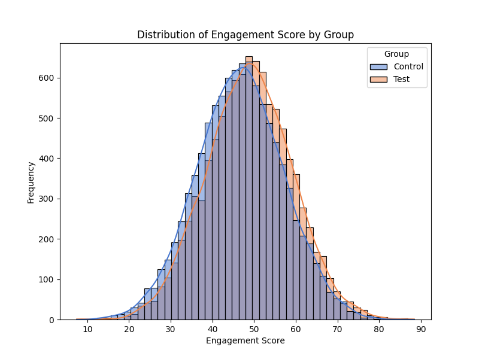
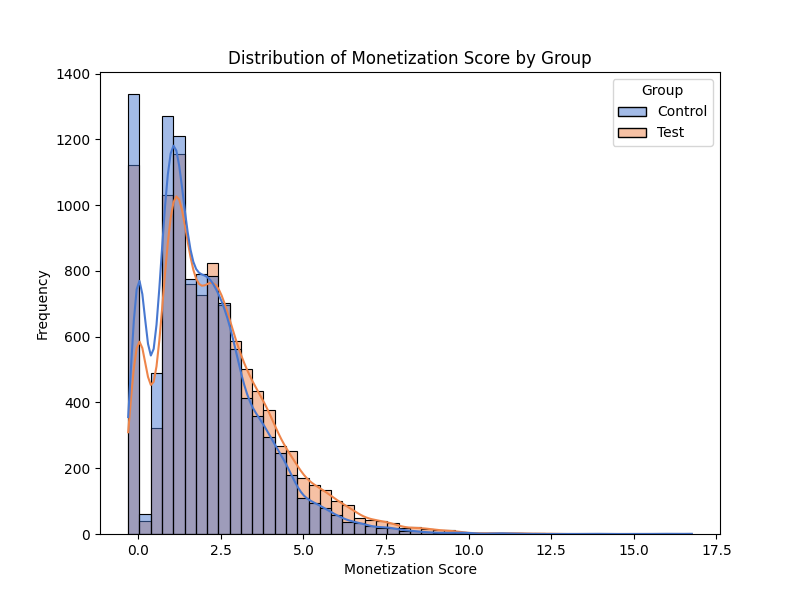

# A/B Test: User Engagement & Monetization Score Analysis
- 이 프로젝트는 A/B 테스트를 통해 유저의 참여도와 과금 정도에 긍정적인 변화가 있는지를 분석한 실습입니다.  
- **Engagement Score**와 **Monetization Score**를 정의하고, control group과 test group 간의 차이를 통계적 관점에서 비교합니다.
- 참고한 본래 포스팅에서 통계적 오류를 교정했습니다.

##  주요 분석 내용

1. **Engagement Score **
   - Engagement score= (session+Time_spent_minutes+Actions_Per_Session)/3
   
   - 정규 분포 확인  
   - Test Group에서 평균 engagement score 상승 확인
   - Welch’s t-test(이분산 t-test) 사용 가능.

3. **Monetization Score **
   - Monetization score=Purchases*Average_Purchase_Value/10
   
   - Test Group에서 monetization score 향상
   - 우측으로 치우친(right-skewed) 분포 => 정규성 가정이 깨지므로, t-test 사용 불가함. 원 글에서는 t-test를 적용 했으나 본 프로젝트에서는 비모수 검정법인 Wilcoxon Rank-Sum Test를 사용함.

## 📈 결과 요약

| 항목 | 결과 |
|------|------|
| Engagement 변화 | Test Group에서 유의미한 증가 |
| Monetization 변화 | 정규성이 부족해 비모수 검정 사용, Test Group에서 증가 경향 |

---

## 참고자료

- [Optimizing Game Design with Data: My Journey in A/B Testing for Engagement and Monetization](https://halbeeb.medium.com/optimizing-game-design-with-data-my-journey-in-a-b-testing-for-engagement-and-monetization-d812bf58360f)을 기반으로 작성됨.

